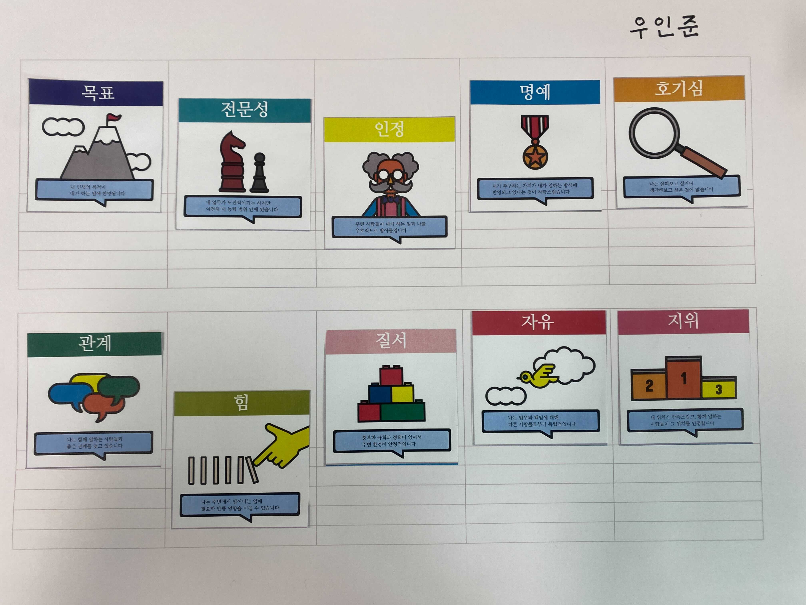

# 2021-07-26\(Mon\)

## Facts \(사실, 객관\)

* 첫 PR 후 배포 & 테스트를 마쳤다.
* 부트캠프 - 애디슨 오퍼월 주요지표를 마쳤다.
* 애디슨 팀 주간회고를 진행했다.

## Feelings \(느낌, 주관\)

* 오늘은 내 PR이 처음으로 상용 서비스에 합쳐진 기념비적인 날이다~! 아직 CS 관리 페이지의 속도를 개선한 코드에 지나지 않지만, 작더라도 다른 사람에게 도움주는 코드를 만들었다는게 넘 기분좋다ㅎㅎ 앞으로 더 좋은 임팩트를 내는 코드를 작성하고 싶다.
* 부트캠프를 통해 애디슨 제품의 흥망성쇠를 알게 되었고, 이를 통해 빠른 실행 & 피드백의 가치를 새삼 느꼈다.
* 주간회고에서 Motivation and Engagement를 진행했는데, 내 상태 뿐만 아니라 다른 팀원들이 중시하는 가치를 확인할 수 있어서 굉장히 긍정적인 경험이었다. 이미 상당히 만족스럽게 일하고 있긴한데, '전문성', '인정', '힘'을 올리면 더 만족스럽게 일할 수 있을 것 같다.

## Findings \(배운 점\)

* PR을 날릴 때는, PR 목표가 무엇인지, 목표는 달성되는 코드인지, PR을 리뷰하는 동료가 무엇을 확인하고 싶어할지 센스있게 생각해서 날려야하는 것을 새삼 배웠다. 가령 슬로우 쿼리를 해결했다면, 기존 쿼리와 개선 후 쿼리문을 비교할 수 있게끔 before/after로 PR에 표시하는 것이 센스인듯. 

## Affimation \(자기 선언\)

* 나는 소프트 스킬도 내가 갖춘 것과 갖추지 못한 것을 구분해내고, 후자를 확실히 갖춰낸다.

