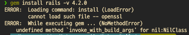

# Rails 환경 구성

퍼펙트 루비온레일즈 집필 시점의 Rails 안정판 버전은 4.2.0이라고 한다.

나는 처음엔 RVM으로 환경을 구성하였으나, [rbenv가 RVM에 비해 장점이 많다](https://github.com/rbenv/rbenv/wiki/Why-rbenv%3F)고 하여 RVM을 삭제하고 rbenv를 이용하여 개발환경을 구성하였다.

### 1\) `rbenv`으로 환경 구성

[초레가](https://www.railsguidebook.com/contents/rbenv.html)를 참고하자.

### 2\) `RVM`으로 환경 구성

```text
# ruby 2.3.0 version install
rvm reload
rvm install 2.3.0
rvm use 2.3.0  
#use 명령은 터미널이 닫히면 효력이 없어진다. 
#매번 use 명령으로 설정하지 않으려면 --default 옵션을 사용하자.
​
# gemset 으로 개발환경을 나누어 관리 시작하기
rvm gemset create perfect_rails
rvm use 2.3.0
rvm gemset use perfect_rails
​
# Ruby on Rails 4.2.0 버전 설치하기
gem install rails -v 4.2.0
```



위와 같은 오류가 나면 이 [스택오버플로우 글](https://stackoverflow.com/questions/15129355/ruby-2-0-rails-gem-install-error-cannot-load-such-file-openssl/15133391)을 참고하자.

* [참고1](http://blog.ableit.co.kr/?p=179)
* [참고2](https://m.blog.naver.com/PostView.nhn?blogId=potter777777&logNo=220738975186&proxyReferer=https:%2F%2Fwww.google.com%2F)

### 혹시나 RVM을 삭제하고 rbenv로 개발환경을 만들려?

1. `rvm implode`를 명령어를 실행한다.
2. 아래 파일들에 RVM 관련된 설정값이 있는지 확인하여 삭제한다. 자세한건 [링크](https://stackoverflow.com/questions/3558656/how-to-remove-rvm-ruby-version-manager-from-my-system/25571648#25571648)를 참고하자.

   ```text
   ~/.bashrc 
   ~/.bash_profile 
   ~/.profile 
   ~/.zshrc
   ~/.zlogin
   ```

3. `~/.bash_profile`에 아래 코드를 삽입한다.

   ```text
   if which rbenv > /dev/null; then eval "$(rbenv init -)"; fi
   ```

4. 만약 zsh 사용으로 인해 `bash_profile`이 제대로 불러와지지 않는다면, `~/.zshrc`에 아래 코드를 추가하자.

   ```text
   if [ -f ~/.bash_profile ]; then
     . ~/.bash_profile
   fi
   ```

이제 터미널을 reload하면 된다.

